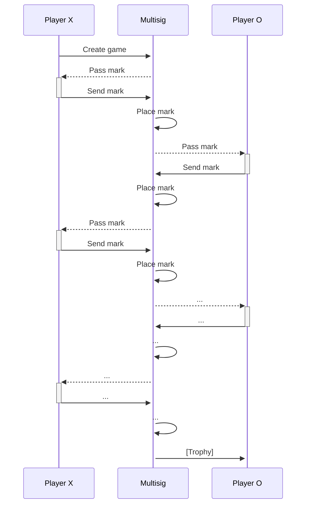

# Multisig Tic Tac Toe

>[!IMPORTANT]
> This example has moved! **Find the latest version in the Sui repo's [examples/tic-tac-toe](https://github.com/MystenLabs/sui/tree/main/examples/tic-tac-toe) directory**, next to a variant that uses consensus and shared objects.

Instead of sharing the game-board, it belongs to the multi-sig account of the two players

This pattern uses a multi-sig account which holds some information that should be accessible from multiple accounts instead of a shared-object.
Tic tac toe has also been implemented using a shared-object for gameboard, or by passing the whole gameboard between two players.

This solution does not use shared-objects, but instead has the gameboard in a multisig 1 out of 2 account.
The Mark is passed between the game players.

A potential application of this pattern is the case when we want an object to be used asynchronously between two to ten accounts.

- Create game: Using the `create_game` move call from the multisig account, a game is created and a mark is passed to player X.
- Send mark: Using the `send_mark` move call from the player account, the mark is sent to the multisig account.
- Place mark: Using the `place_mark` move call from the multisig account, the mark is placed on the gameboard, and is passed to the next player for the next turn.
- Pass mark is not a separate call. It is an action that is automatically triggered either when creating a game or when placing a mark while the game is not finished.

All multisig calls are sponsored by the player account.

## Pros & Cons of pattern

| In respect to shared-object | In respect to game-admin |
| --- | --- |
| ~~+ Ability to delete object after game finished~~ | + No need for a third entity |
| + No order consensus needed | |
| - Care should be taken to prevent equivocation | - Care should be taken to prevent equivocation |
| - Way more complicated contract | - More complicated contract |
| - More complicated client integration | - More complicated client integration |
| - More transactions per action |  |
| - Max 10 users |  |

### Directories structure

- contract:
    - Contains the Move code of the smart contract

- rust-cli-client:
    - `cargo run -- --private-key <PRIVATE_KEY> --opponent-public-key <OPPONENT_PUBLIC_KEY> <PLAYING_AS>` where keys in Base64 and PLAYING_AS: X|O.
    One can find private keys in _~/.sui/sui_config/sui.keystore_ and public keys using `sui keystore list`.
    - Note: Application supports only Ed25519 keyscheme

- app: vite react application for playing in the browser
    - `pnpm run dev`
    - Note: Application supports only Ed25519 keyscheme

- setup: Taken from https://github.com/MystenLabs/poc-template
    - A Typescript project, with ready-to-use:
        - environment variable (.env) file reading
        - Sui SDK integration
        - publish shell script

