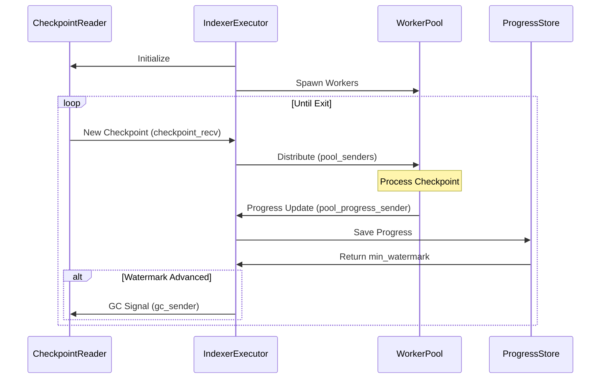

# Custom indexer

The `iota-data-ingestion-core` crate provides an easy solution for creating custom indexers. To implement a custom indexer, you subscribe to a checkpoint stream with full checkpoint content. This stream can be one of the publicly available streams from IOTA, one that you set up in your local environment, or a combination of the two.

Establishing a custom indexer helps improve latency, allows pruning of the data of your IOTA Full node, and provides an efficient assemblage of checkpoint data.

## Overview

To start implementing a custom Indexer, the [Worker](https://iotaledger.github.io/iota/iota_data_ingestion_core/trait.Worker.html) trait must be implemented:

```rust
#[async_trait]
pub trait Worker: Send + Sync {
    type Message: Send + Sync;
    type Error: Debug + Display;

    async fn process_checkpoint(&self, checkpoint: Arc<CheckpointData>) -> Result<Self::Message, Self::Error>;

    fn preprocess_hook(&self, _: Arc<CheckpointData>) -> Result<(), Self::Error> {
        Ok(())
    }
}
```

The `process_checkpoint` method is the central component of this trait. It handles the processing of data extracted from the `CheckpointData` struct and its subsequent
storage. The `CheckpointData` struct encapsulates the complete content of a checkpoint, containing a summary, the checkpoint data itself, and detailed information about each transaction, including associated events and input/output objects. The [Reducer](https://iotaledger.github.io/iota/iota_data_ingestion_core/trait.Reducer.html) can later use the Worker's [Message](https://iotaledger.github.io/iota/iota_data_ingestion_core/trait.Worker.html#associatedtype.Message) associated type to apply further data processing.

Depending on the use case, the `iota-data-ingestion-core` optionally provides the [Reducer](https://iotaledger.github.io/iota/iota_data_ingestion_core/trait.Reducer.html) trait, which requires an implementation of the [Worker](https://iotaledger.github.io/iota/iota_data_ingestion_core/trait.Worker.html) trait. For use cases see this [section](#process-checkpoints-in-batches)

```rust
#[async_trait]
pub trait Reducer<Mapper: Worker>: Send + Sync {
    async fn commit(&self, batch: Vec<Mapper::Message>) -> Result<(), Mapper::Error>;

    fn should_close_batch(
        &self,
        _batch: &[Mapper::Message],
        next_item: Option<&Mapper::Message>,
    ) -> bool {
        next_item.is_none()
    }
}
```

The design of these two traits closely mirrors the [MapReduce](https://en.wikipedia.org/wiki/MapReduce) methodology.

Specifically:

- **Worker (Map):** The `Worker` trait performs the "map" operation. Its associated `Message` type holds the data that will be processed and subsequently used by the `Reducer`.
- **Reducer (Reduce):** The `Reducer` trait executes the "reduce" operation, aggregating and processing the `Message` data produced by the `Worker`.

The framework offers three modes for sourcing checkpoint data: **Local**, **Remote**, and **Hybrid** (Local + Remote), allowing for flexible data ingestion strategies.

#### Local

The local checkpoint fetcher is ideal when the indexer and a Full Node run on the same machine. By configuring the Full Node to save generated checkpoints to a local directory, `iota-data-ingestion-core` can monitor this directory for changes using an inotify-based mechanism. This minimizes ingestion latency, as checkpoints are processed immediately after they are generated by the Full Node.

#### Remote

The remote checkpoint fetcher is useful when the indexer and Full Node reside on separate machines. The Full Node can be configured to expose a REST API for checkpoint retrieval.

#### Hybrid

A hybrid configuration combines local and remote stores, providing a fallback mechanism for continuous data ingestion. The framework prioritizes locally available checkpoint data. This mode is beneficial when transitioning to using a local Full Node for data ingestion while needing to backfill historical data or provide failover capabilities.

## Detailed API Functionality

To fully understand the inner workings and configuration options of `iota-data-ingestion-core`, a closer look at its API is necessary. While the `Worker` trait dictates the processing and storage of `CheckpointData`, the `IndexerExecutor` is responsible for orchestrating the workers and implementing the core ingestion logic. Before diving into the details of the `IndexerExecutor`, we will first analyze the components it relies on.

### Checkpoint Reader

The `CheckpointReader` actor is responsible for reading and managing `CheckpointData` from multiple sources, including local files and remote storage. In addition to fetching new checkpoints, it tracks which checkpoints have been processed, performs garbage collection by deleting processed checkpoint files from local storage, and enforces a memory limit during batch processing to prevent out-of-memory (OOM) conditions. The `CheckpointReader` is instantiated using the [initialize](https://github.com/iotaledger/iota/blob/v0.10.1-beta/crates/iota-data-ingestion-core/src/reader.rs#L331) method.

```rust
pub fn initialize(
    // The directory on which checkpoints will be read
    path: PathBuf,
    // From which checkpoint sequence number to start fetching new checkpoints
    starting_checkpoint_number: CheckpointSequenceNumber,
    // Provide a remote URL to download checkpoints
    remote_store_url: Option<String>,
    // Any config key-value pair for the Remote fetcher
    remote_store_options: Vec<(String, String)>,
    // Customize and optimize the Checkpoint fetch behavior
    options: ReaderOptions,
) -> (
    Self,
    // Channel the Workers will listen and process & store checkpoints
    mpsc::Receiver<Arc<CheckpointData>>,
    // Channel on which workers will notify GC of the checkpoint
    mpsc::Sender<CheckpointSequenceNumber>,
    // Graceful shutdown
    oneshot::Sender<()>,
)
```

The `ReaderOptions` struct provides options for configuring how the checkpoint reader fetches new checkpoints.

```rust
pub struct ReaderOptions {
    // How often to check for new checkpoints
    // Lower values mean faster detection but more CPU usage
    // Default: 100ms
    pub tick_interval_ms: u64,
    // Network request timeout
    // Applies to remote store operations
    // Default: 5 seconds
    pub timeout_secs: u64,
    // Maximum concurrent remote requests
    // Higher values increase throughput but use more resources
    // Default: 10
    pub batch_size: usize,
    // Memory limit for processing batch checkpoints
    // 0 means no limit
    // Helps prevent OOM issues
    pub data_limit: usize,
}
```

The [run](https://github.com/iotaledger/iota/blob/v0.10.1-beta/crates/iota-data-ingestion-core/src/reader.rs#L362) method is responsible for starting the actor. It creates an [inotify](https://man7.org/linux/man-pages/man7/inotify.7.html) listener to monitor the local directory for new files. The method then enters a loop with a `tokio::select!` statement to handle three execution branches:

```rust
loop {
    tokio::select! {
        // Graceful shutdown
        _ = &mut self.exit_receiver => break,
        // Receive from Workers the processed checkpoint sequence numbers, this means that the
        // files are no longer needed and a GC can be safely performed
        Some(gc_checkpoint_number) = self.processed_receiver.recv() => {
            self.gc_processed_files(gc_checkpoint_number).expect("Failed to clean the directory");
        }
        // `self.sync()` is invoked either after waiting `self.options.tick_interval_ms`
        // without a new file notification, or immediately upon receiving such a notification.
        Ok(Some(_)) | Err(_) = timeout(Duration::from_millis(self.options.tick_interval_ms), inotify_recv.recv())  => {
            self.sync().await.expect("Failed to read checkpoint files");
        }
    }
}
```

The [sync](https://github.com/iotaledger/iota/blob/v0.10.1-beta/crates/iota-data-ingestion-core/src/reader.rs#L257) method manages the retrieval of checkpoints, coordinating between local and (optionally) remote sources. It prioritizes local checkpoints, using the [read_local_files](https://github.com/iotaledger/iota/blob/v0.10.1-beta/crates/iota-data-ingestion-core/src/reader.rs#L82) method to fetch them from the local directory. Remote fetching, performed by the [remote_fetch](https://github.com/iotaledger/iota/blob/v0.10.1-beta/crates/iota-data-ingestion-core/src/reader.rs#L230) method, is only activated if the local checkpoints are missing or lag behind the expected sequence. This design ensures that local storage is the primary source of truth.

- [read_local_files](https://github.com/iotaledger/iota/blob/v0.10.1-beta/crates/iota-data-ingestion-core/src/reader.rs#L82) method iterates through all entries in the configured directory, attempting to extract a sequence number from each filename. It filters out entries with sequence numbers lower than the current checkpoint number (`current_checkpoint_number`). The remaining entries are then sorted in ascending order by sequence number. The function then attempts to deserialize each remaining file as a `CheckpointData` struct but only adds the deserialized checkpoint to the result if adding it does not exceed the configured capacity (`data_limit`).
- [remote_fetch](https://github.com/iotaledger/iota/blob/v0.10.1-beta/crates/iota-data-ingestion-core/src/reader.rs#L230) method fetches checkpoints from a remote store. It supports the Full Node REST API and various object-store interfaces, including [Amazon S3](https://docs.rs/object_store/latest/object_store/aws/index.html), [Google Cloud Storage](https://docs.rs/object_store/latest/object_store/gcp/index.html), and [WebDAV](https://docs.rs/object_store/latest/object_store/http/index.html). Based on the configuration, it can also create a hybrid client combining an object store and a REST API client. It fetches checkpoints in batches, starting from the `current_checkpoint_number`, and retrieves data until the `batch_size` is reached. While iterating through the fetched checkpoints, it checks for capacity limitations. If the capacity is exceeded, it stops fetching and returns the collected checkpoints.

### Progress Store

The [ProgressStore](https://iotaledger.github.io/iota/iota_data_ingestion_core/trait.ProgressStore.html) plays a crucial role in tracking the progress of checkpoint synchronization for each WorkerPool. This ensures that the WorkerPool can resume synchronization from the last successfully processed checkpoint after an Indexer restart. The framework offers two built-in implementations:

- [ShimProgressStore](https://iotaledger.github.io/iota/iota_data_ingestion_core/struct.ShimProgressStore.html): A simple, in-memory progress store primarily used for unit testing. It does not persist progress across restarts.
- [FileProgressStore](https://iotaledger.github.io/iota/iota_data_ingestion_core/struct.FileProgressStore.html): A persistent progress store that uses a JSON file to track each WorkerPool synchronization state.

Custom progress stores can be created by implementing the `ProgressStore` trait.

```rust
#[async_trait]
pub trait ProgressStore: Send {
    async fn load(&mut self, task_name: String) -> Result<CheckpointSequenceNumber>;
    async fn save(
        &mut self,
        task_name: String,
        checkpoint_number: CheckpointSequenceNumber,
    ) -> Result<()>;
}
```

Instead of directly using the custom `ProgressStore` implementation, the `IndexerExecutor` interacts with it through a wrapper:

```rust
pub type ExecutorProgress = HashMap<String, CheckpointSequenceNumber>;

pub struct ProgressStoreWrapper<P> {
    // Our custom implemented ProgressStore
    progress_store: P,
    // An internal Map holding the TaskName and the CheckpointSequenceNumber
    pending_state: ExecutorProgress,
}
```

This wrapper implements the `ProgressStore` trait. Internally, it retrieves progress data from the underlying `ProgressStore` implementation and populates its internal cache. This cached data is then used to calculate the minimum watermark efficiently across all tracked tasks.

> [!NOTE]
> A **watermark** indicates the _next_ checkpoint sequence number that will be processed. All checkpoints with sequence numbers _less than_ the watermark have been fully processed by all workers. It serves multiple important purposes:
>
> 1. **Progress Tracking**
>
> - Keeps track of which checkpoints have been fully processed across all workers
> - Ensures no checkpoints are skipped during synchronization
> - It provides a reliable way to resume processing after the system restarts
>
> 2. **Garbage Collection**
>
> - Used to determine which checkpoint files can be safely removed from local storage
> - Only checkpoints with sequence numbers below the watermark are eligible for deletion
>
> The system maintains two types of watermarks:
>
> 1. **Individual Worker Watermarks**
>
> - Each worker tracks its progress through individual watermarks
> - Workers report their progress after successfully processing each checkpoint
>
> 2. **Global Minimum Watermark**
>
> - Represents the minimum watermark across all workers
> - Used to ensure consistency and data safety
> - Critical for garbage collection decisions
>
> ### Example
>
> - If the watermark is `11`, it means that checkpoints `0` through `10` have been successfully processed, and checkpoint `11` is the next to be processed.
> - The system may have received checkpoints `12`, `13`, `14`, and so on, but it will only update the watermark to `12` once it's sure that checkpoint `11` has been fully processed by all workers
> - Upon a restart, the system uses the watermark value (`11` in this example) to tell the workers that checkpoint `11` is the checkpoint sequence number they should start processing.

### WorkerPool

The `WorkerPool` actor has the responsibility to coordinate and manage `Workers`

```rust
pub struct WorkerPool<W: Worker> {
    // An unique name of the WorkerPool task.
    pub task_name: String,
    // How many instances of the current Worker to create, more workers are created
    // more checkpoints they can process in parallel.
    concurrency: usize,
    // The actual Worker instance itself
    worker: Arc<W>,
    // The reducer instance, responsible for batch processing
    reducer: Option<Box<dyn Reducer<W>>>,
}
```

The [run](https://iotaledger.github.io/iota/iota_data_ingestion_core/struct.WorkerPool.html#method.run) method implements the core worker behavior and management logic. It maintains a set of `worker_id`s (ranging from `0` to `concurrency - 1`) to ensure each worker processes a distinct checkpoint without race conditions. A `VecDeque` cache of `CheckpointData` is used to buffer incoming checkpoints from the `CheckpointReader` when no workers are immediately available.

The worker pool's size is determined by the `concurrency` value. The pool is implemented as a vector of tasks, one for each `Worker` instance. `mpsc` channels are used for communication, allowing the pool to receive `CheckpointData`. After initializing the worker pool, the actor enters a loop with a `tokio::select!` statement to handle two distinct execution branches:

```rust
 loop {
	tokio::select! {
		// Receives a synced checkpoint notification from the Worker
		Some(worker_progress_msg) = progress_receiver.recv() => {
		   match worker_progress_msg {
			   WorkerStatus::Running((worker_id, checkpoint_number, message)) => {...},
			   WorkerStatus::Shutdown(worker_id) => {...}
		   }
		}
		// Receive a `CheckpointData` from CheckpointReader
		Some(checkpoint) = checkpoint_receiver.recv() => {
			...
		}
	}
}
```

- The first branch marks the `worker_id` as idle, sends the `checkpoint_number` and `message` to the watermark task, this particular task enforces ordered checkpoint execution by calculating the latest watermark. Lastly, this branch checks the cache for pending checkpoints and assigns any found to the idle `worker_id`.
- The second branch handles incoming `CheckpointData` from the `CheckpointReader`. It discards checkpoints with sequence numbers less than the `current_checkpoint_number`, assuming they have already been processed. It then invokes the optional [preprocess_hook](https://iotaledger.github.io/iota/iota_data_ingestion_core/trait.Worker.html#method.preprocess_hook) method (defined in the `Worker` trait) to allow for validation, preparation, or caching of checkpoint data. If the hook executes successfully and an idle worker is available, the checkpoint is sent for processing, otherwise, it is added to the cache for later processing.

> [!NOTE]
> Each `Worker` pool spawns a watermark task, after each `WorkerStatus::Running` event, the `Worker` pool sends the received `checkpoint_number` and `message` to the watermark task, its behavior varies based on the presence of a `Reducer`:
>
> - **With `Reducer`:** The watermark is computed and sent to the `Executor` _after_ each successful commit of a batch by the `Reducer`.
> - **Without `Reducer`: **The watermark is computed and sent to the `Executor` after each chunk of processed checkpoints, ensuring sequential progress updates.

### Indexer Executor

The `IndexerExecutor` actor is the coordinator of the entire framework logic.

```rust
pub struct IndexerExecutor<P> {
    // Holds the registered WorkerPools actors
    pools: Vec<Pin<Box<dyn Future<Output = ()> + Send>>>,
    // Store the Sender half of the channel to notofy Worker Pool of new CheckpointData
    pool_senders: Vec<mpsc::Sender<Arc<CheckpointData>>>,
    // A wrapper around the implemented ProgressStore by having an internal cache
    progress_store: ProgressStoreWrapper<P>,
    // Worker Pools will send on this channel and notify the Executor that
    // the Checkpoint was synced and a GC operation can be performed
    pool_progress_sender: mpsc::Sender<WorkerPoolStatus>,
    // Listens on synced checkpoints from Worker Pools and performs GC operation
    pool_progress_receiver: mpsc::Receiver<WorkerPoolStatus>,
    metrics: DataIngestionMetrics,
    // Receive graceful shutdown signal
    token: CancellationToken,
}
```

```rust
pub fn new(progress_store: P, number_of_jobs: usize, metrics: DataIngestionMetrics, token: CancellationToken) -> Self {..}
```

Instantiating an `IndexerExecutor` using the [new](https://iotaledger.github.io/iota/iota_data_ingestion_core/struct.IndexerExecutor.html#method.new) method requires careful consideration of the `number_of_jobs` parameter. This parameter determines the capacity of a buffered `mpsc` channel used for communication, calculated as `number_of_jobs * MAX_CHECKPOINTS_IN_PROGRESS` (where `MAX_CHECKPOINTS_IN_PROGRESS` is defined as 10000). The sender end of this channel is cloned and provided to each registered `WorkerPool`. Each `WorkerPool` also maintains its internal buffered channel with a capacity of `MAX_CHECKPOINTS_IN_PROGRESS` to track its internal progress. Therefore, as a best practice, the `number_of_jobs` should be set equal to the number of registered worker pools to ensure efficient and reliable communication of progress updates.

```rust
pub async fn register<W: Worker + 'static>(&mut self, pool: WorkerPool<W>) -> Result<()> {..}
```

After instantiation, the `IndexerExecutor` requires registration of one or more `WorkerPool` instances via the [register](https://iotaledger.github.io/iota/iota_data_ingestion_core/struct.IndexerExecutor.html#method.register) method to function. During registration, the executor retrieves the last recorded watermark from its `ProgressStoreWrapper`, using it as the initial checkpoint sequence number for synchronization. The `register` method also creates a buffered `mpsc` channel with a capacity of `MAX_CHECKPOINTS_IN_PROGRESS` and stores the `WorkerPool` in its internal `pools` vector. While the [pool.run()](https://github.com/iotaledger/iota/blob/v0.10.1-beta/crates/iota-data-ingestion-core/src/executor.rs#L64-L69) method is called, it does not begin execution until awaited. The sender half of the created channel is stored in `pool_senders` vector for later distribution of `CheckpointData`.

```rust
pub async fn run(
    mut self,
    // The directory on which checkpoints will be read
    path: PathBuf,
    // Provide a remote URL to download checkpoints
    remote_store_url: Option<String>,
    // Any config key-value pair for the Remote fetcher
    remote_store_options: Vec<(String, String)>,
    // Customize and optimize the Checkpoint fetch behavior
    reader_options: ReaderOptions,
) -> Result<ExecutorProgress> {..}
```

The [run](https://iotaledger.github.io/iota/iota_data_ingestion_core/struct.IndexerExecutor.html#method.run) method executes the actor's main logic; it's the main orchestrator of the checkpoint processing pipeline. It coordinates between:

- Checkpoint reading (local/remote)
- Worker pool management
- Progress tracking
- Garbage collection
- Metric reporting

The following diagram shows on a high level the overall flow:



To initiate checkpoint fetching, the `CheckpointReader` requires an initial checkpoint sequence number. This number is obtained by calling the `ProgressStoreWrapper`'s [min_watermark](https://github.com/iotaledger/iota/blob/v0.10.1-beta/crates/iota-data-ingestion-core/src/progress_store/mod.rs#L72) method. This ensures that no checkpoints are skipped during synchronization and serves as the garbage collection starting point. Subsequently, the `CheckpointReader` is started in a separate task by invoking its [run](https://iotaledger.github.io/iota/iota_data_ingestion_core/struct.IndexerExecutor.html#method.run) method.

> [!NOTE]
> While each `WorkerPool` retrieves its watermark during registration, the executor also calculates a global minimum watermark at startup needed for the `CheckpointReader`.
>
> This is crucial because different `WorkerPool` instances might target different storage backends. The global minimum watermark ensures that each pool has the opportunity to synchronize the necessary checkpoints for its specific storage, even if other pools have already registered those checkpoints to different targets.
>
> Subsequently, each `WorkerPool` uses its `current_checkpoint_number` (set during registration) to discard redundant checkpoints, preventing duplicate processing.

The next step is to spawn the worker pools in separate tasks:

```rust
let (workers, workers_join_handles) = self.spawn_workers(progress_sender, token.clone());
```

Finally, the actor enters a loop with a `tokio::select!` statement to handle two distinct execution branches:

```rust
tokio::select! {
	Some(worker_pool_progress_msg) = self.pool_progress_receiver.recv() => {
		match worker_pool_progress_msg {
			// Receive processed checkpoints from Worker Pools, update the ProgressStore,
			// calculate its minimum watermark and perform GC operation
			WorkerPoolStatus::Running((task_name, watermark)) => {
				self.progress_store.save(task_name.clone(), watermark).await.map_err(|err| IngestionError::ProgressStore(err.to_string()))?;
				let seq_number = self.progress_store.min_watermark()?;
				if seq_number > reader_checkpoint_number {
					gc_sender.send(seq_number).await.map_err(|_| {
						IngestionError::Channel(
							"unable to send GC operation to checkpoint reader, receiver half closed"
								.to_owned(),
						)
					})?;
					reader_checkpoint_number = seq_number;
				}
				self.metrics.data_ingestion_checkpoint.with_label_values(&[&task_name]).set(watermark as i64);
			}
			// Manages the graceful shutdown sequence of the entire indexer system.
			WorkerPoolStatus::Shutdown(worker_pool_name) => {
			  // Track worker pools that have initiated shutdown.
			  worker_pools_shutdown_signals.push(worker_pool_name);
			}
		}
	}
	// Distribution of checkpoints across Worker pools
	// Only process new checkpoints while system is running (token not cancelled).
	// The guard prevents accepting new work during shutdown while allowing existing work to complete for other branches.
	Some(checkpoint) = checkpoint_recv.recv(), if !self.token.is_cancelled() => {
		for sender in &self.pool_senders {
			sender.send(checkpoint.clone()).await?;
		}
	}
}
```

- The first branch is responsible for receiving the progress of processed checkpoints from worker pools, it accepts two kinds of messages:
  - `WorkerPoolStatus::Running`: it records the current watermark for each task in the progress store. Calculates the lowest watermark across all tasks. If the minimum watermark exceeds the checkpoint reader's current watermark, it signals the reader to initiate garbage collection. Updates the checkpoint reader's last pruned watermark to reflect the new minimum.
  - `WorkerPoolStatus::Shutdown`: collects shutdown signals from worker pools.
- The second branch is responsible for distributing the incoming checkpoints from `CheckpointReader` across all Workers Pools. The guard `if !self.token.is_cancelled()` prevents the acceptance of new work during shutdown while allowing existing work to be completed, ensuring a clean transition to system termination.

> [!NOTE]
>
> The shutdown sequence in the data ingestion system follows a carefully orchestrated flow that ensures all components terminate cleanly while preserving data integrity. When a shutdown is initiated via the [CancellationToken](https://docs.rs/tokio-util/latest/tokio_util/sync/struct.CancellationToken.html), it triggers a cascade of graceful shutdowns starting from the innermost workers up through the system hierarchy.
>
> At the worker level, individual workers within each `WorkerPool` detect the cancellation signal and begin their shutdown sequence. They first complete processing their current checkpoint and ensure all progress updates are sent through their respective channels. This guarantees that no work is interrupted mid-processing and all progress is properly recorded.
>
> The `WorkerPool` coordinates shutdown through its workers' completion signals rather than the cancellation token directly. While individual workers shut down upon detecting the token cancellation, the pool itself tracks these shutdowns through received `WorkerStatus::Shutdown` messages from each worker. Only when the pool has received shutdown signals matching its total number of workers does it send `WorkerPoolStatus::Shutdown` to the IndexerExecutor. During this process, the pool continues processing any remaining progress messages, ensuring all work is completed before signaling its final shutdown to the executor.
>
> The `IndexerExecutor` acts as the orchestrator for the entire shutdown process. It continues to process progress messages from all pools while tracking which pools have completed their shutdown via the received `WorkerPoolStatus::Shutdown` signals. Only when all worker pools have reported their shutdown does the executor proceed with the final shutdown steps. It then awaits the completion of all worker pool tasks, signals the `CheckpointReader` to stop, and ensures all components have terminated properly before shutting down itself.
>
> This hierarchical shutdown approach ensures that data integrity is maintained throughout the shutdown process, with no work being interrupted and all progress being saved to storage. The shutdown sequence flows from workers to pools to executor, with each level waiting for its subordinate components to complete before finalizing its own shutdown. This creates a clean, predictable shutdown pattern that prevents data loss and maintains system consistency.

### Process checkpoints

For straightforward applications requiring immediate, per-checkpoint processing and storage, the `Worker` trait is ideal. Its direct processing model enables efficient, real-time data handling and allows for immediate storage of processed checkpoint data into a remote store after each checkpoint is processed.

**1. Real-Time Transaction filtering:**

- **Scenario:** You need to store transactions within each checkpoint against a set of rules or an external service.
- **`Worker` Trait Usage:**
  - The `Worker`'s `process_checkpoint` method analyzes each transaction in the checkpoint.
  - It performs the filters to extract the interested transactions and save them to the desired Database or external service.
  - The `Message` type can be mapped to an empty tuple (e.g. `Message = ()`) since we don't use the `Reducer`.

**2. Direct Data Export to External Systems:**

- **Scenario:** You need to export specific data from each checkpoint to an external system (e.g., a logging service, a message queue, or a third-party API) in real-time.
- **`Worker` Trait Usage:**
  - The `Worker` extracts the necessary data from each checkpoint.
  - The `process_checkpoint` method formats the data and sends it to the external system.
  - The `Message` type can be mapped to an empty tuple (e.g. `Message = ()`) since we don't use the `Reducer`.

**3. Archival Indexer:**

- **Scenario:** You need to create a comprehensive, near real-time archive of all data from an IOTA full node, starting from genesis and extending to the latest network tip.
- **`Worker` Trait Usage:**
  - The `Worker` is responsible for extracting all relevant data from each incoming checkpoint.
  - The `process_checkpoint` method parses the checkpoint data and directly persists it into a database or archival storage system.
  - The `Message` associated type can be set to an empty tuple (`Message = ()`). Since this is an archival use case without a `Reducer`, the `Message` type is primarily used for trait compliance and doesn't require carrying any specific data.

### Process checkpoints in batches

If you need to add batching capabilities to your custom indexer, the [Reducer](https://iotaledger.github.io/iota/iota_data_ingestion_core/trait.Reducer.html) trait is the right choice. The size of the batch is determined by the [should_close_batch](https://iotaledger.github.io/iota/iota_data_ingestion_core/trait.Reducer.html#method.should_close_batch)
logic, every batch is committed by the [commit](https://iotaledger.github.io/iota/iota_data_ingestion_core/trait.Reducer.html#tymethod.commit) method.

#### Use Cases for `Worker` and `Reducer` Traits:

**1. Indexing Transaction Data with Batching for Database Efficiency:**

- **Scenario:** You need to process transactions from each checkpoint and store relevant data in a database.
- **`Worker` Trait Usage:**
  - The `Worker` trait's `process_checkpoint` method is used to extract relevant transaction data from each checkpoint.
  - The `Message` associated type of the `Worker` holds the extracted and prepared data for each transaction.
- **`Reducer` Trait Usage:**
  - The `Reducer` trait is used to batch the transaction data from multiple checkpoints before writing to the database.
  - `should_close_batch` is used to determine when a batch is full, (e.g. based on several transactions or the size of the data).
  - `commit` method performs the actual database insertion, efficiently handling multiple transactions in a single operation.
  - This batching strategy significantly reduces the number of database write operations, improving performance.

**2. Aggregating and Storing Network Statistics:**

- **Scenario:** You want to collect and store network statistics, such as transaction counts, block sizes, or network activity, from each checkpoint across epochs.
- **`Worker` Trait Usage:**
  - The `Worker` trait's `process_checkpoint` method is used to calculate the necessary statistics for each checkpoint.
  - The `Message` associated type holds the calculated statistics.
- **`Reducer` Trait Usage:**
  - The `Reducer` trait is used to aggregate the statistics from multiple checkpoints into larger batches.
  - `should_close_batch` is used to determine when a batch is full, (e.g. based on the epoch sequence number, time frames, or checkpoints count).
  - The `commit` method then stores the aggregated statistics in a database or time-series data store.
  - This approach reduces the frequency of database writes and allows for efficient storage of aggregated data.

**3.** **Real-Time Alerting System:**

- **Scenario:** You need to monitor blockchain activity and trigger alerts when specific events occur (e.g., large transactions, suspicious activity).
- **`Worker` Trait Usage:**
  - The `Worker` analyzes transaction data within each checkpoint.
  - It applies rules to detect triggering events.
  - The `Message` type contains alert details (event type, transaction ID, relevant data).
- **`Reducer` Trait Usage:**
  - The `Reducer` aggregates alerts and filters out duplicates or related alerts.
  - `should_close_batch` is used to determine when a batch is full, (e.g. based on time frames).
  - The `commit` method sends alerts via email, SMS, or other notification channels.

## Use cases

The use cases for the `iota-data-ingestion-core` can be endless. It not only could be used to create Custom Indexers but also for analyzing the data and integrate it with external systems

#### 1. **Building Custom Indexers for Specific Data:**

- **Indexing Only the Necessary Data:** Depending on the specific use case, a custom indexer can be developed to store only the relevant data. For example, businesses can register transactions based on the sender and recipient, allowing them to retain essential transactional data for the parties they need without the concern that a full node may delete this information.
- **Indexer as a service**: Provide users with the tools to efficiently index and query specific data, unlocking the potential of the IOTA Tangle for various applications.

#### 2. **Data Analysis and Visualization:**

- **Historical Analysis:** Analyzing historical data to identify trends, patterns, and anomalies.
- **Real-time Analytics:** Processing data in real-time to generate insights and alerts.
- **Data Visualization:** Creating visualizations to represent data insights in a user-friendly way.

#### 3. **Integration with External Systems:**

- **Data Pipelines:** Integrating with other data processing systems (e.g., Apache Kafka, Apache Spark) for large-scale data processing.
- **Machine Learning:** Feeding indexed data into machine learning models for predictive analytics.
- **Alerting Systems:** Triggering alerts based on specific events or conditions identified in the data.

## Usage in existing crates

As an example of a custom indexer the `iota-data-ingestion-core` is used in the `iota-indexer` and `iota-analytics-indexer` both persist data in different storages with completely different use cases:

- **iota-indexer**: The primary function of the indexer is to provide historical data from the ledger, which is crucial for both Explorer and developers who want to utilize ledger data in their applications. By pre-processing and storing this data, the indexer significantly reduces the load on the full node, preventing performance degradation from frequent queries. The data is stored in `PostgreSQL`.

- **iota-analytics-indexer**: This specialized indexer is designed to extract and export relevant blockchain data from the IOTA network. It collects and stores data related to network statistics (such as transaction volume and throughput), user activity (including the number of active addresses and transaction patterns), and smart contract interactions (e.g., Move call executions). The extracted data is efficiently stored in Object Storage, such as **AWS S3**. Subsequently, this raw data is transferred to specialized data warehouses like **BigQuery** or **Snowflake**. These columnar databases are optimized for handling large datasets and performing complex analytical queries, enabling in-depth analysis of IOTA network activity.
